# Framework 과목평가

Framework

웹 페이지를 개발하는 과정에서 겪는 어려움을 줄이는 것이 주 목적

데이터베이스 연동, 템플릿 형태의 표준, 세션 관리, 코드 재사용 등의 기능


동기적으로 일어난다 => a다음 b가 일어나는 연속적인 행위

비동기적 => 세탁기, 로봇 청소기, 식기세척기 등 시키는 행위

## MTV Design Pattern

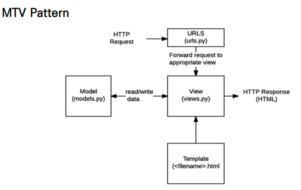

### Model

​	데이터베이스의 기록을 관리(추가, 수정, 삭제)

​	데이터베이스 : CRUD 컨트롤 리드

​	Create, Read, Update, Delete

### Template

​	파일의 구조나 레이아웃을 정의, 실제로 내용을 보여줌

### View

​	HTTP 요청을 수신하고 응답을 반환, Model을 통해 요청을 충족시키는데 필요한 데이터에 접근

​	Template에게 응답의 서식 설정을 맡김


MVC Pattern

model view controller


### Project 

Project(이하 프로젝트)는 Application(이하 앱)의 집합 (collection of apps)

프로젝트에는 여러 앱이 포함될 수 있음 

앱은 여러 프로젝트에 있을 수 있음 

### Application

앱은 실제 요청을 처리하고 페이지를 보여주고 하는 등의 역할을 담당 

하나의 프로젝트는 여러 앱을 가짐 

일반적으로 앱은 하나의 역할 및 기능 단위로 작성함


### INSTALLED_APPS 

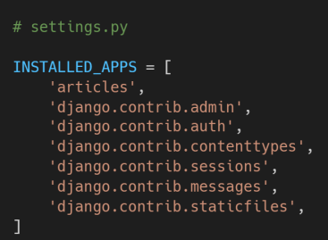Django installation에 활성화 된 모든 앱을 지정하는 문자열 목록

앱을 생성 한 후 등록!


### URLS

HTTP 요청(request)을 알맞은 view로 전달

### VIEW

HTTP 요청을 수신하고 HTTP응답을 반환하는 함수 작정

Model을 통해 요청에 맞는 필요 데이터에 접근

### Templates

실제 내용을 보여줘는데 사용되는 파일

파일의 구조나 레이아웃을 정의(HTML)

기본값은 **app폴더 안의 templates 폴더**로 지정되어 있음


### GET/POST

get = 데이터 서칭 요청을 하면 정보를 조회하고 찾아준다, url에 전송하는 정보가 나온다.

post = 데이터 처리 요청을 하면 데이터를 처리하고 완료되었다고 알려준다, url에 전송하는 정보가 나오지 않는다

 ......?

## Model이란?

- 단일한 데이터에 대한 정보를 가짐

  - 사용자가 저장하는 데이터들의 필수적인 필드들과 동작들을 포함

- 저장된 데이터베이스의 구조(layout)

- django는 model을 통해 데이터에 접속하고 관리

- 일반적으로 각각의 moedl은 하나의 데이터베이스 테이블에 매핑


## 웹 어플리케이션의 데이터를 구조화하고 조작하기 위한 도구

모델 != 데이터베이스


## Database

- 데이터베이스(DB)
  - 체계화된 데이터들의 모임
- 쿼리(Query)
  - 데이터를 조회하기 위한 명령어 
  - 조건에 맞는 데이터를 추출하거나 조작하는 명령어

## Database 기본구조

### 스키마

- 데이터베이스에서 자료의 구조, 표현방법, 관계 등을 정의한 구조

### 테이블

#### 행(row) : 필드(field) or 속성

#### 열, 컬럼(column) : 레코드(record) or 튜플

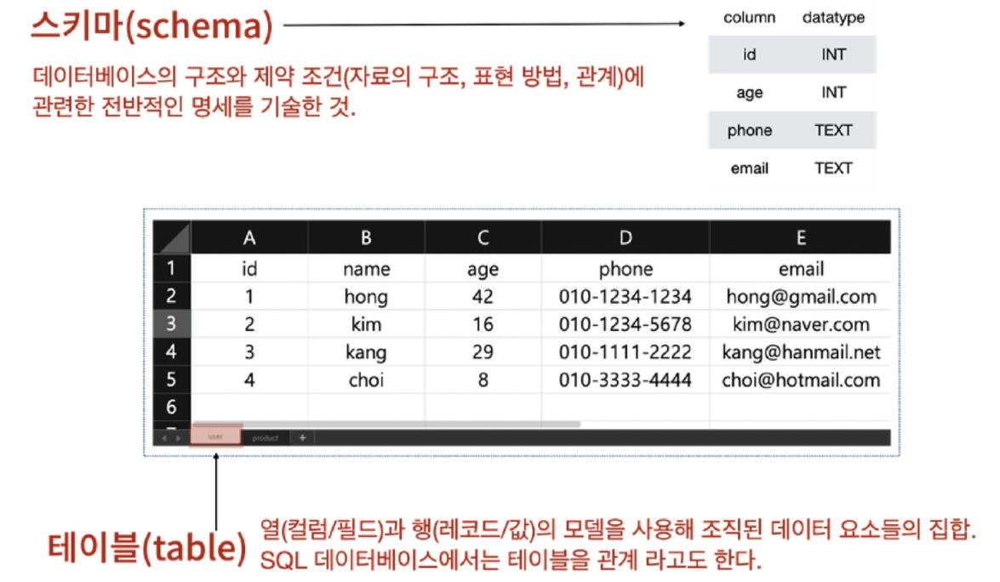


# ORM : Object-Relational-Mapping

- 객체 지향 프로그래밍 언어를 사용하여 **호환되지 않는 유형의 시스템 간에(Django-SQL)데이터를 변환**하는 프로그래밍 기술
- OOP 프로그래밍에서 RDBMS을 연동할 때, 데이터베이스와 객체 지향 프로그래밍 언어간의 **호환되지 않는 데이터를 변환하는 프로그래밍 기법**
- Django는 내장 Django ORM을 사용

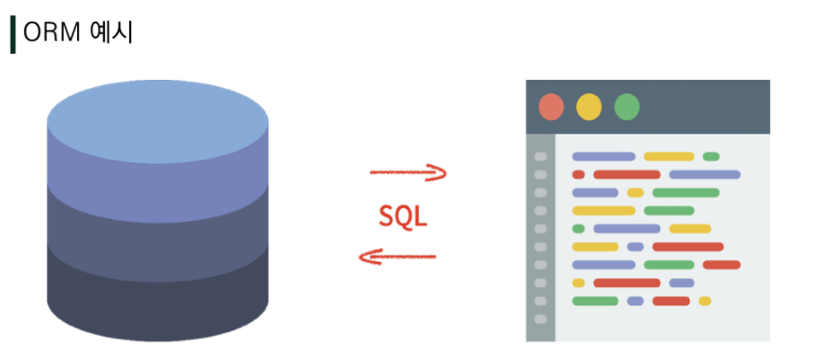

####    			  	DD(SQL)																		Django(python)

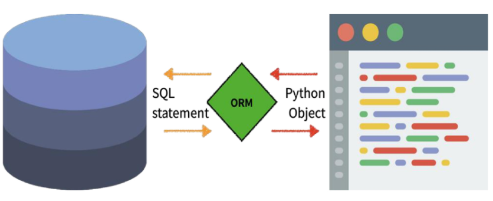

우리는 DB를 객체(object)로 조작하기 위해 ORM을 사용한다


# Migration

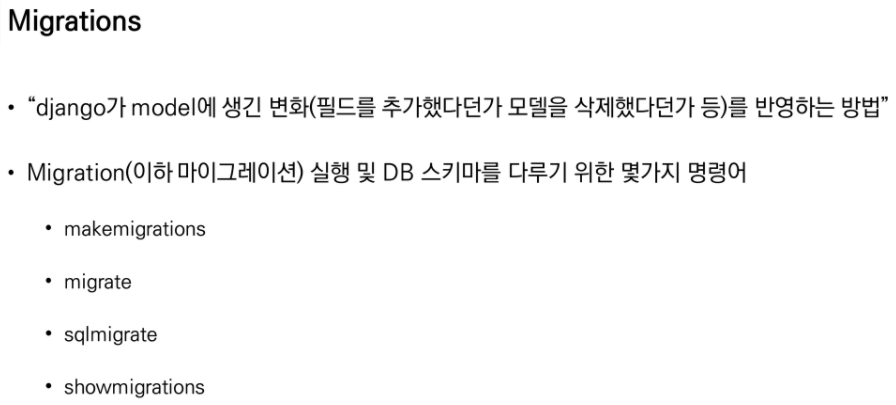

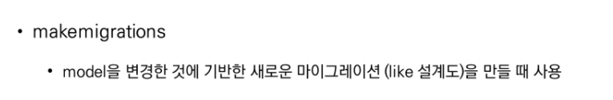


# Database_API

- 파이썬(객체)
- 'DB를 조작하기 위한 도구'
- django가 기본적으로 ORM을 제공함에 따른 것으로 DB를 편하게 조작할 수 있음
- Model을 만들면 django는 객체들을 만들고 읽고 수정하고 지울 수 있는 database-abstract API를 자동으로 만듦
- database-abstract API 혹은 database-access API 라고도 함

queries = 명령문, 명령어

### Manager

#### 	django 모델에 데이터베이스 query 작업이 제공되는 인터페이스

​			단지 인터페이스일 뿐이다!

#### 	기본적으로 모든 django 모델 클래스에 objects라는 Manager를 추가 

### QuerySet (중요)

#### 	데이터베이스로부터 전달받은 객체 목록

#### 	queryset 안의 객체는 0개, 1개 혹은 여러 개일 수 있음

#### 	데이터베이스로부터 조회, 필터, 정렬 등을 수행 할 수 있음


# CRUD

대부분의 컴퓨터가 소프트웨어가 가지는 기본적인 데이터 처리 기능

Create(생성)

Read(읽기)

Update(갱신)

Delete(삭제)

를 묶어서 일컫는 말

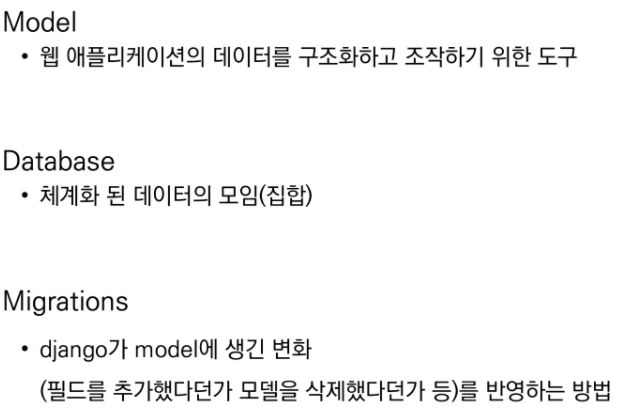

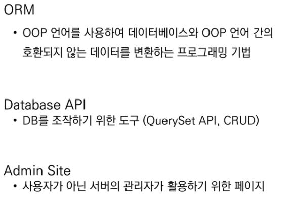


 


# HW 문제 확인

__(a)__는 Django에서 URL 자체를 변수처럼 사용해서 동적으로 주소를 만드는 것을 의미한다

### Variable Routing


Django 프로젝트는 render할 template 파일들을 찾을 때, 기본적으로 settings.py에 등록된 각 앱 폴더 안의 __(a)__ 폴더 내부를 탐색한다.

### /templates/ 경로


### 1 ) 지문의 코드 중 form 태그의 속성인 action의 역할에 대해 설명하시오. 

submit버튼을 눌렀을 때 /create/ 로 저장된 데이터를 전송해준다


### 2 ) 지문의 코드 중 method가 가질 수 있는 속성 값을 작성하시오. 

**POST, GET**


### 3 ) input 태그에 각각 `안녕하세요`, `반갑습니다`, `파이팅` 문자열을 넣고 submit 버튼을 눌렀을 때 이동하는 url 경로를 작성하시오

​	**=> url.py:port/create/ => views.py => views.py 에서 def로 요청되는 index.html(예시)**


##### “Django가 Model에 생긴 변화를 DB에 반영하는 방법” 을 뜻하는 용어를 작성하시오.

### Migrations (migrate)


## Python Shell

#### Django에서 사용 가능한 모듈 및 메서드를 대화식 Python Shell에서 사용하려고 할 때,  어떤 명령어를 통해 해당 Shell을 실행할 수 있는지 작성하시오. 

```bash
# 설치
pip install ipython
pip install django-extensions

# 실행
python manage.py shell_plus
```


#### models.py를 작성한 후 마이그레이션 작업을 위해 터미널에 작성해야 하는 두 개의 핵심 명령어를 작성하시오

```bash
python manage.py makemigrations
python manage.py migrate
```


#### 2 ) 

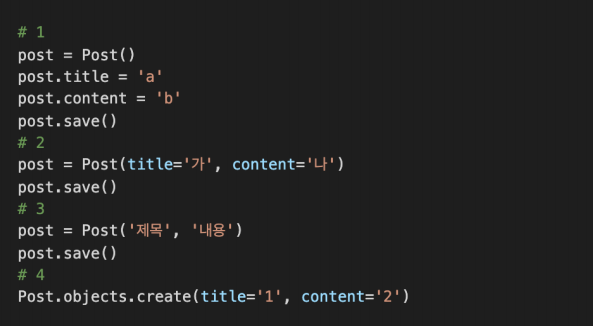

​                         3 잘못됨 키워드 인자를 넣어야한다


####  Post가 10개 저장되어 있고 id의 값이 1부터 10까지라고 가정할 때 가장 첫 번째 Post를 가져오려고 한다. 다음 중 옳지 않은 코드를 고르시오.

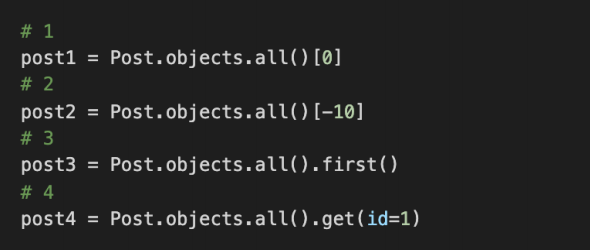

​						2번 불가능 음수인덱스는 쿼리셋에서 사용 불가능


#### my_post 변수에 Post 객체 하나가 저장되어 있다.  title을 “안녕하세요” content를 “반갑습니다” 로 수정하기 위한 코드를 작성하시오.

```python
post = Post.objects.get()
title = '안녕하세요'
content = '반갑습니다'
article.title = title
article.content = content
article.save()
```


#### 5 ) 만들어진 모든 Post 객체를 QuerySet형태로 반환 해주기 위해 빈칸에 들어갈 코드를 작성하시오

`posts = Post.objects.all()`


queryset란 뭘까

​	데이터베이스로부터 전달받은 객체목록

​	데이터베이스로부터 조회, 필터, 정렬 등을 수행 할 수 있음

query - 데이터를 조회하기 위한 명령어

쿼리를 날린다 => DB를 조작한다


**승영** - save()

영배 - csrf_token

형선 - ORM, Object-Relational-Mapping

의진 - DateTimeField(* ) / auto_now_add / auto_now

은영 - POST / GET
